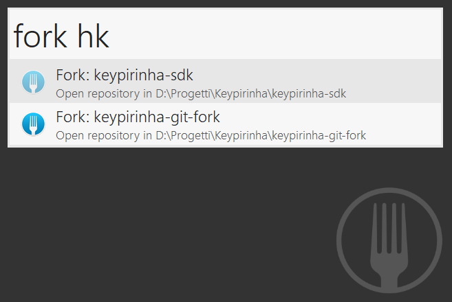

# Keypirinha Plugin: Git-Fork

This a plugin for the [Keypirinha](http://keypirinha.com) launcher, which adds
catalog items for all repositories known to [Git Fork](https://git-fork.com/).
Launching any of these items will open the repository in Fork.

Hit `Tab` for extra options, including opening a repository in the configured
shell, or in File Explorer.

## Download and installation

Grab the most recent
[release package](https://github.com/fran-f/keypirinha-git-fork/releases)
and copy it to the `InstalledPackage` directory of Keypirinha.

If you have installed Keypirinha, this will be under your profile folder, at
`%APPDATA%\Keypirinha\InstalledPackages`. If you are using it in *portable
mode*, look under `Keypirinha\portable\Profile\InstalledPackages`.

## License

This package is distributed under the terms of the MIT license.

